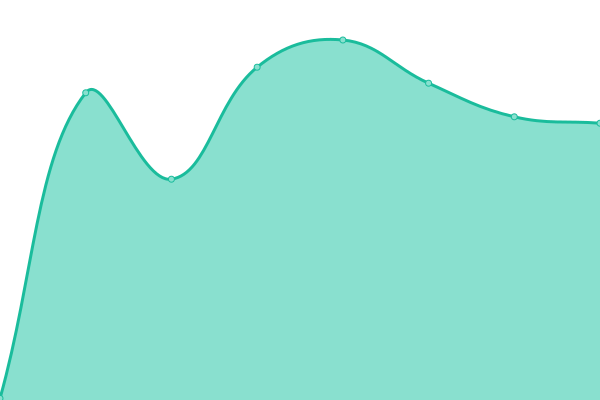

# [📈 Live Status](https://status.stephens.link): <!--live status--> **🟧 Partial outage**

This repository contains the open-source uptime monitor and status page for [Greg Stephens](http://gstephens.org), powered by [Upptime](https://github.com/upptime/upptime).

With [Upptime](https://upptime.js.org), you can get your own unlimited and free uptime monitor and status page, powered entirely by a GitHub repository. We use [Issues](https://github.com/rgstephens/upptime/issues) as incident reports, [Actions](https://github.com/rgstephens/upptime/actions) as uptime monitors, and [Pages](https://status.stephens.link) for the status page.

<!--start: status pages-->
<!-- This summary is generated by Upptime (https://github.com/upptime/upptime) -->
<!-- Do not edit this manually, your changes will be overwritten -->
<!-- prettier-ignore -->
| URL | Status | History | Response Time | Uptime |
| --- | ------ | ------- | ------------- | ------ |
|  [tonk.link](https://tonk.link) | 🟥 Down | [tonk-link.yml](https://github.com/rgstephens/upptime/commits/HEAD/history/tonk-link.yml) | 

 353ms
     
 | 

<a href="https://rgstephens.github.io/upptime/history/tonk-link">39.42%</a>
    

|  [play.tonk.link](https://play.tonk.link) | 🟥 Down | [play-tonk-link.yml](https://github.com/rgstephens/upptime/commits/HEAD/history/play-tonk-link.yml) | 

 303ms
     
 | 

<a href="https://rgstephens.github.io/upptime/history/play-tonk-link">39.42%</a>
    

|  [Golftrip](https://golftrip.link) | 🟥 Down | [golftrip.yml](https://github.com/rgstephens/upptime/commits/HEAD/history/golftrip.yml) | 

 353ms
     
 | 

<a href="https://rgstephens.github.io/upptime/history/golftrip">39.42%</a>
    

|  [Avkana](https://avkana.com) | 🟥 Down | [avkana.yml](https://github.com/rgstephens/upptime/commits/HEAD/history/avkana.yml) | 

 350ms
     
 | 

<a href="https://rgstephens.github.io/upptime/history/avkana">39.42%</a>
    

|  [gstephens](https://gstephens.org) | 🟥 Down | [gstephens.yml](https://github.com/rgstephens/upptime/commits/HEAD/history/gstephens.yml) | 

 372ms
     
 | 

<a href="https://rgstephens.github.io/upptime/history/gstephens">39.42%</a>
    

|  [BGC](https://broadmoorgolfclub.com) | 🟩 Up | [bgc.yml](https://github.com/rgstephens/upptime/commits/HEAD/history/bgc.yml) | 

 754ms
     
 | 

<a href="https://rgstephens.github.io/upptime/history/bgc">100.00%</a>
    

|  [BHA](https://broadmoorhomeowners.com) | 🟩 Up | [bha.yml](https://github.com/rgstephens/upptime/commits/HEAD/history/bha.yml) | 

 979ms
     
 | 

<a href="https://rgstephens.github.io/upptime/history/bha">100.00%</a>
    

|  [MDI Maui](https://mdimaui.com) | 🟩 Up | [mdi-maui.yml](https://github.com/rgstephens/upptime/commits/HEAD/history/mdi-maui.yml) | 

 694ms
     
 | 

<a href="https://rgstephens.github.io/upptime/history/mdi-maui">100.00%</a>
    

|  [Natmed](https://natmed.net) | 🟩 Up | [natmed.yml](https://github.com/rgstephens/upptime/commits/HEAD/history/natmed.yml) | 

 304ms
     
 | 

<a href="https://rgstephens.github.io/upptime/history/natmed">100.00%</a>
    

|  [FishOn](https://fishonwithjon.com) | 🟥 Down | [fish-on.yml](https://github.com/rgstephens/upptime/commits/HEAD/history/fish-on.yml) | 

 349ms
     
 | 

<a href="https://rgstephens.github.io/upptime/history/fish-on">39.42%</a>
    

|  [Cryptoagent](https://cryptoagent.us) | 🟥 Down | [cryptoagent.yml](https://github.com/rgstephens/upptime/commits/HEAD/history/cryptoagent.yml) | 

 324ms
     
 | 

<a href="https://rgstephens.github.io/upptime/history/cryptoagent">39.42%</a>
    

|  [RasaAlerts](https://rasaalerts.com) | 🟥 Down | [rasa-alerts.yml](https://github.com/rgstephens/upptime/commits/HEAD/history/rasa-alerts.yml) | 

 361ms
     
 | 

<a href="https://rgstephens.github.io/upptime/history/rasa-alerts">39.42%</a>
    

|  [minio-ui](https://minio-ui.gstephens.org) | 🟥 Down | [minio-ui.yml](https://github.com/rgstephens/upptime/commits/HEAD/history/minio-ui.yml) | 

 406ms
     
 | 

<a href="https://rgstephens.github.io/upptime/history/minio-ui">39.42%</a>
    

|  [Jokebot REST endpoint](https://jokebot.rasabot.us/webhooks/rest) | 🟥 Down | [jokebot-rest-endpoint.yml](https://github.com/rgstephens/upptime/commits/HEAD/history/jokebot-rest-endpoint.yml) | 

 251ms
     
 | 

<a href="https://rgstephens.github.io/upptime/history/jokebot-rest-endpoint">39.42%</a>
    

|  [RISbot REST endpoint](https://risbot.rasabot.us/webhooks/rest) | 🟥 Down | [ri-sbot-rest-endpoint.yml](https://github.com/rgstephens/upptime/commits/HEAD/history/ri-sbot-rest-endpoint.yml) | 

 262ms
     
 | 

<a href="https://rgstephens.github.io/upptime/history/ri-sbot-rest-endpoint">39.42%</a>
    

|  [Haystack Demo REST endpoint](https://haystackbot.rasabot.us/webhooks/rest) | 🟥 Down | [haystack-demo-rest-endpoint.yml](https://github.com/rgstephens/upptime/commits/HEAD/history/haystack-demo-rest-endpoint.yml) | 

 196ms
     
 | 

<a href="https://rgstephens.github.io/upptime/history/haystack-demo-rest-endpoint">39.33%</a>
    

<!--end: status pages-->

[**Visit our status website →**](https://status.stephens.link)

## 📄 License

- Powered by: [Upptime](https://github.com/upptime/upptime)
- Code: [MIT](./LICENSE) © [Greg Stephens](http://gstephens.org)
- Data in the `./history` directory: [Open Database License](https://opendatacommons.org/licenses/odbl/1-0/)
